### Overview
Action Time Battle System developed using Blueprints. Started as a group project contribution, the task developed as a standalone system that can be easily integrated inside a pre-existing project. Using **State Trees** for combat flow logic and **UMG Widgets** for player interaction this system takes inspiration from titles such as [***Final Fantasy VII Rebirth***](https://www.youtube.com/watch?v=GL33pUIwZ5U). 

### My role
- Gameplay Programmer (solo)
- Responsibilities: core mechanics, systems integration, prototyping

### What I built
- State Tree driven Combat System 
- Active Time Gauge mechanic to Queue up Combatants
- Component based Combatants
- Simple extendable AI Opponent logic
- Data-Driven Abilities and Ability Sets
- UMG HUB with Dynamic Layout that changes based on Gameplay Triggers

### Technical highlights
- **Engine / Framework**: Unreal
- **Languages**: Blueprints
- **Systems**: State Trees, UMG, DataAssets, Gameplay Framework.

### Challenges & solutions
- One of the team's requirements was for this system to be developed entirely using Blueprints as most of the team, including the team lead were not comfortable dealing with C++, some functionalities had to be reworked to address this limitation as some C++ features as well as some of the UE5 C++ APIs and DSAs couldn't be accessed in Blueprints, which meant that for instance Queues needed to be implementated in Blueprints instead of using UE5 C++'s TQueue data structure. 
- While having past experience working in Blueprints, C++ still remains the preferred choice as it can streamline development without having to worry about point and click over UI and Node manipulation. 
- Creating a Queue that could be pruned based on Combatants states (e.g. Queued up combatant dies before its turn) was something that needed some extra care. 
- Making sure the UI was in sync with the Combatant Manager combat flow. 
- Adding UI art was challenging and required some extra time to get up to speed with texture manipulation and UMG Wdigets setup.  

### Class Diagram

```mermaid
classDiagram
%% ===== Core Gameplay =====
class BP_CombatManager {
  +bool bActiveMode
  +bool bFillEnabled
  +float GlobalATBRate
  +int ReadyCounter
  +UStateTreeComponent* StateTreeComp
  +TArray~FCombatantInfo~ Combatants
  +TArray~UCombatantComponent*~ ReadyQueue
  +UCombatantComponent* CurrentActor
  +FQueuedAction PendingAction
  --
  +StartBattle()
  +EndBattle(bVictory:bool)
  +SetFillEnabled(b:bool)
  +TickAllATB(Delta:float)
  +HandleReady(Comp:UCombatantComponent*)
  +EnterCommandSelect(Comp:UCombatantComponent*)
  +ExitCommandSelect()
  +SubmitPlayerCommand(Action:FQueuedAction)
  +StartActionFromPlayer()
  +StartActionFromAI(Comp:UCombatantComponent*) : FQueuedAction
  +PlayAction()
  +NotifyImpact()
  +NotifyActionFinished()
  +IsPartyDefeated() : bool
  +IsEnemyTeamDefeated() : bool
  --
  <<Dispatchers>>
  +OnBattleStarted()
  +OnActorReady(Comp:UCombatantComponent*)
  +OnActionStarted(Action:FQueuedAction)
  +OnActionEnded(Action:FQueuedAction)
  +OnBattleEnded(bVictory:bool)
}

class UCombatantComponent {
  +float HP
  +float MaxHP
  +float MP
  +float MaxMP
  +float Speed
  +float HasteMult
  +float ATB_Current
  +float ATB_Max
  +bool bReady
  +bool bAlive
  +bool bPlayerControlled
  +int TeamId
  --
  +TickATB(Delta:float)
  +ConsumeATB(Cost:float)
  +ApplyDamage(Amount:float, Instigator:UObject*)
  +CanAct() : bool
  +GetUsableAbilities(Out: TArray~DA_Ability*~)
  +BuildActionFromInput(Ability:DA_Ability*, Targets:TArray~UCombatantComponent*~) : FQueuedAction
  +StopFilling()
  +StartFilling()
  --
  <<Dispatchers>>
  +OnATBChanged(Comp:UCombatantComponent*, Percent:float)
  +OnBecameReady(Comp:UCombatantComponent*)
  +OnActionStarted(Comp:UCombatantComponent*, Ability:DA_Ability*)
  +OnActionEnded(Comp:UCombatantComponent*, Ability:DA_Ability*)
  +OnDeath(Comp:UCombatantComponent*)
}

class DA_Ability {
  <<data asset>>
  +FText Name
  +float ATBCost
  +float CastTime
  +float Power
  +ETargetingRule TargetingRule
  +UAnimMontage* Montage
  +USoundBase* SFX
  +UNiagaraSystem* VFX
  +int MP_Cost
  +FGameplayTagContainer Tags
  --
  +ComputeEffect(Source:UCombatantComponent*, Target:UCombatantComponent*) : FEffectResult
}

%% ===== Player-side =====
class BP_PlayerController {
  +BP_CombatManager* CombatManagerRef
  +BP_HUD* HUDRef
  +bool bMenuOpen
  --
  +InitializeHUD()
  +BindToManager(InMgr:BP_CombatManager*)
  +OpenCommandMenu(Comp:UCombatantComponent*)
  +CloseCommandMenu()
  +OnConfirm(Action:FQueuedAction)
}

class BP_HUD {
  +BP_PlayerController* PC
  +BP_CombatManager* Manager
  +WBP_TurnQueue* TurnQueueW
  +WBP_CommandMenu* CommandMenuW
  +TMap~UCombatantComponent*, WBP_ATBBar*~ ATBBars
  +TArray~WBP_QueueEntry*~ Pool_Free
  +TMap~UCombatantComponent*, WBP_QueueEntry*~ Pool_Active
  --
  +Initialize(InPC:BP_PlayerController*)
  +BindToManager(InMgr:BP_CombatManager*)
  +ShowCommandMenu(Comp:UCombatantComponent*)
  +HideCommandMenu()
  +RefreshTurnQueue(ReadyQueue:TArray~UCombatantComponent*~)
  +MarkCurrentActor(Comp:UCombatantComponent*)
  +SpawnATBBarFor(Comp:UCombatantComponent*)
  --
  <<Handlers>>
  +OnActorReady(Comp:UCombatantComponent*)
  +OnActionStarted(Action:FQueuedAction)
  +OnActionEnded(Action:FQueuedAction)
}

%% ===== UI Widgets =====
class WBP_CommandMenu {
  +UCombatantComponent* OwnerComp
  +TArray~DA_Ability*~ Abilities
  --
  +SetOwnerCombatant(Comp:UCombatantComponent*)
  +PopulateAbilities(Comp:UCombatantComponent*)
  +BuildAndConfirm()
  --
  <<Dispatchers>>
  +OnConfirm(Action:FQueuedAction)
  +OnCancel()
}

class WBP_TurnQueue {
  +UPanelWidget* ListPanel
  --
  +SetQueue(ReadyQueue:TArray~UCombatantComponent*~)
  +HighlightCurrent(Comp:UCombatantComponent*)
}

class WBP_QueueEntry {
  +UCombatantComponent* Comp
  +int OrderIndex
  --
  +BindCombatant(Comp:UCombatantComponent*)
  +SetOrderIndex(Index:int)
  +SetIsCurrent(b:bool)
  +SetIsDead(b:bool)
}

class WBP_ATBBar {
  +UCombatantComponent* Comp
  --
  +BindCombatant(Comp:UCombatantComponent*)
  +SetPercent(Pct:float)
  +PulseReady()
  +FadeOut()
}

%% ===== Structs =====
class FCombatantInfo {
  <<struct>>
  +AActor* Actor
  +UCombatantComponent* Comp
  +int TeamId
  +bool bPlayerControlled
}

class FQueuedAction {
  <<struct>>
  +UCombatantComponent* Source
  +DA_Ability* Ability
  +TArray~UCombatantComponent*~ Targets
  +float QueuedTime
  +int ReadyOrder
}

%% ===== Relationships =====
BP_PlayerController --> BP_HUD : owns/initializes
BP_PlayerController --> BP_CombatManager : references/binds

BP_HUD ..> BP_CombatManager : subscribes to dispatchers
BP_HUD o--> WBP_TurnQueue : owns
BP_HUD o--> WBP_CommandMenu : owns
BP_HUD o--> WBP_ATBBar : owns many
BP_HUD o--> WBP_QueueEntry : pools many

BP_CombatManager o--> UStateTreeComponent : runs ST_CombatFlow
BP_CombatManager "1" o--> "many" UCombatantComponent : Combatants/ReadyQueue
UCombatantComponent ..> DA_Ability : queries/uses

WBP_CommandMenu ..> BP_PlayerController : OnConfirm→PC.OnConfirm
WBP_ATBBar ..> UCombatantComponent : binds events
WBP_TurnQueue o--> WBP_QueueEntry : contains many
```

---

### Links
- Repo: <a href="https://github.com/AbderrahimJami/UE5-Action-Time-Battle-System" target="_blank" rel="noopener noreferrer"><i class="fab fa-github"></i>
GitHub</a>
- Demo: <a href="https://abderrahimjami.itch.io/thesteroidolympics" target="_blank" rel="noopener noreferrer"><i class="fab fa-itch-io"></i>
Itch.io</a>

---

## Demo

<!--  -->
