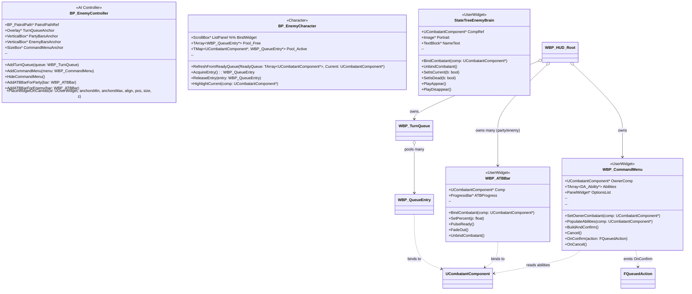

# Hello World!

This is a quick placeholder you can edit as you practice writing, formatting, and publishing with Jekyll.

---

This is my first post, I've never really used this before, but I'm confident I'll pick it up in not time 💪!

This is me practicing a simple checklist
- [ ] First Checklist item
- [ ] second checklist with **bold formatting**
- [ ] Third checklist item with [***Multiplayer.it***](http://multiplayer.it/)
- [ ] Fourth checklist item with `inline code` 

---

### Youtube embed



### Mermaid diagram 



### Tiny example content
This is an example of a short paragraph using lorem ipsum
Cupidatat cupidatat voluptate mollit quis exercitation. Adipisicing irure ut reprehenderit ullamco non nostrud nulla eiusmod. Cillum consectetur laboris culpa cillum sunt ullamco officia deserunt velit labore cupidatat deserunt enim. Anim excepteur sunt nulla commodo laboris. Dolor in ipsum incididunt magna aliquip qui Lorem quis esse aliquip. Ea aliqua commodo irure pariatur minim est eiusmod sunt. Duis ad cupidatat ea eiusmod Lorem incididunt occaecat occaecat id laborum ullamco.

---


### Code block

Example code block:
```bash
# start local server
./tools/run.sh
```
  